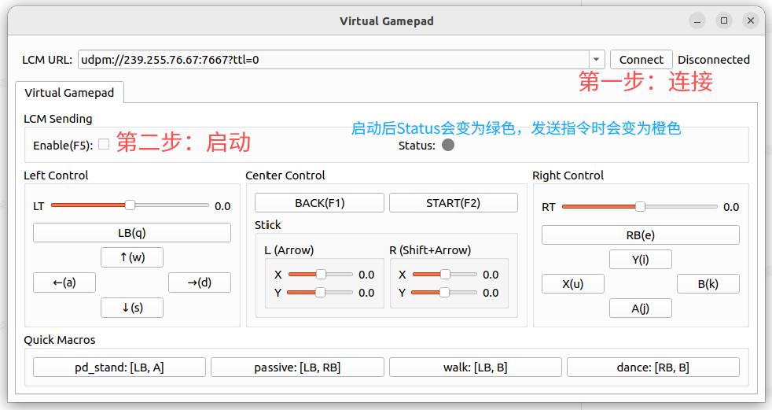
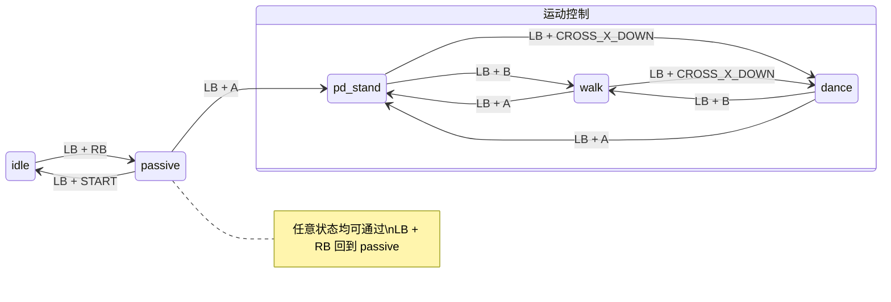

# EngineAI Native Mujoco独立编译包

本目录为**可单独拷贝或打包带走的完整工程**：包含 `build.sh` 所需的全部源码、`cmake/`、`core/` 预编译库、`deps/` 离线依赖副本，以及 **MuJoCo 仿真所需的 `assets/`**（配置、URDF、网格等）。解压到任意路径后，可在本机完成主程序编译与离线仿真运行。

**运行时库路径（EngineAI 部分）**：`env.sh` 在检测到本目录下存在 `deps/engineai_robotics_*` 时，会将 **`ENGINEAI_ROBOTICS_THIRD_PARTY` / `HARDWARE` 仅指向 `deps/`**，从 `LD_LIBRARY_PATH` 中**去掉**已继承的 `/opt/engineai_robotics_*`，并前置 `vendor_glog` / `vendor_fmt` 与本包 `core/lib`，避免误加载系统 `/opt` 里的占位或旧库。ROS 2 仍使用系统安装的 `/opt/ros/humble`（需单独安装）。

## 目录结构（概要）

| 路径 | 说明 |
|------|------|
| `CMakeLists.txt` | 工程根 CMake 配置 |
| `cmake/` | CMake 模块与辅助脚本 |
| `src/` | 应用与协议源码（含 `interface_protocol` colcon 工程） |
| `core/` | Native SDK 预编译核心库（`EngineAICore`） |
| `deps/` | 随包附带的 vendored 依赖（如 `engineai_robotics_third_party`、`engineai_robotics_hardware`、`vendor_glog`、`vendor_fmt` 等） |
| `scripts/` | 工具脚本（含 `build_ros2_env.sh`、`build_mujoco.sh`、`build_compat_vendor_deps.sh` 等） |
| `simulation/mujoco/` | MuJoCo 仿真子工程源码（与 `scripts/build_mujoco.sh` 对应） |
| `assets/` | 机器人配置与模型资源（仿真加载配置、`mode.yaml`、网格/XML 等） |
| `env.sh` | 设置 `LD_LIBRARY_PATH` 等；有 `deps/` 时 EngineAI 相关库**仅用包内路径** |
| `tools/virtual_gamepad/` | 可选：虚拟手柄 UI（无实体手柄时调试） |
| `build.sh` | 与上游仓库一致的构建脚本 |
| `run.sh` | 编译完成后启动 `src_executor`（加载 `env.sh`，运行 `build/_install/bin/src_executor`） |
| `new_build.sh` | 推荐：可选自动 `apt` 安装系统依赖后执行完整编译 |
| `LICENSE.txt` | 许可证 |

## 环境要求

- **操作系统**：Ubuntu 22.04（Jammy）或与 ROS 2 Humble 官方 deb 安装兼容的系统。

## 推荐操作流程

### 1. 编译

> 未经过测试

**方式 A — 使用脚本自动安装联网依赖（推荐首次编译）**

脚本会执行 `sudo apt-get update` 并安装编译所需的开发包与常用 ROS Humble 组件（编译器、cmake、colcon、glog、yaml-cpp、fmt、eigen、lcm、gtest、若干 `ros-humble-*` 包等）：

```bash
chmod +x new_build.sh build.sh
./new_build.sh
```

也可指定并行数与构建类型，例如：

```bash
./new_build.sh -j8 -t releasewithdebinfo
```

**方式 B — 已经完成依赖安装**

> 已经过测试

若机器已安装 ROS Humble 及所需开发包，可以直接编译：

```bash
./build.sh
```

### 2 运行主程序

完成 `./build.sh` 或 `./new_build.sh` 生成 `build/_install/` 后，在本目录执行：

```bash
chmod +x run.sh
./run.sh              # 默认机器人配置
./run.sh pm01_edu     # 指定机型
```
### 3 MuJoCo 仿真

**（1）编译 MuJoCo 可执行文件**

```bash
./scripts/build_mujoco.sh
./scripts/build_mujoco.sh -m  # 假如上一个指令卡住不动，使用这个。使用国内源拉取依赖
```

- CMake 会优先使用本包内 `deps/engineai_robotics_*`，不依赖 `/opt` 占位库。

**（2）运行仿真**

```bash
./scripts/run_mujoco.sh            # 默认机器人配置
./scripts/run_mujoco.sh pm01_edu   # 指定机型
```

**配置说明**：各机型下 `assets/config/<机型>/mode.yaml` 中应为仿真模式（例如 `active_mode: sim`）。包内部分机型已默认 `sim`，可按需修改。

**（3）使用虚拟手柄控制**

首次使用需安装 Python 依赖（`lcm`、`PyQt6` 等）：

```bash
pip install lcm==1.5.0 PyQt6==6.7.1 PyQt6_sip==13.8.0
```

然后：

```bash
python3 tools/virtual_gamepad/virtual_gamepad.py
```
> 注意需要按照图片里的步骤操作



### 状态切换概览

> 请按照状态转换表进行操作，并且切换状态时对机器人的关节位置有要求，否则无法切换状态

| 当前状态     | 允许切换到状态  | 触发按键              | 说明              |
| -------- | -------- | ----------------- | --------------- |
| idle     | passive  | LB + RB           | 从未激活状态过渡到阻尼态    |
| passive  | idle     | LB + START        | 回到未激活状态         |
| passive  | pd_stand | LB + A            | 进入稳定站立控制任务      |
| pd_stand | walk     | LB + B            | 建立稳定站立后，进入行走任务  |
| pd_stand | dance    | LB + CROSS_X_DOWN | 建立稳定站立后，进入跳舞任务  |
| walk     | pd_stand | LB + A            | 从行走任务回到稳定站立控制任务 |
| walk     | dance    | LB + CROSS_X_DOWN | 从行走任务切换到跳舞任务    |
| dance    | pd_stand | LB + A            | 从舞蹈任务回到稳定站立控制任务 |
| dance    | walk     | LB + B            | 从舞蹈任务切换到行走任务    |


### 状态流转示意



### 全局安全机制（Emergency Fallback）

> **任意状态**都可通过 `**LB + RB`** 强制切换到 `passive` 状态。

此功能类似 **软急停（Soft Emergency Stop）**：

- 立即终止当前运动控制逻辑
- 将系统退回到安全被动状态
- 对调试和实际运行非常重要，可降低运动控制失控风险


